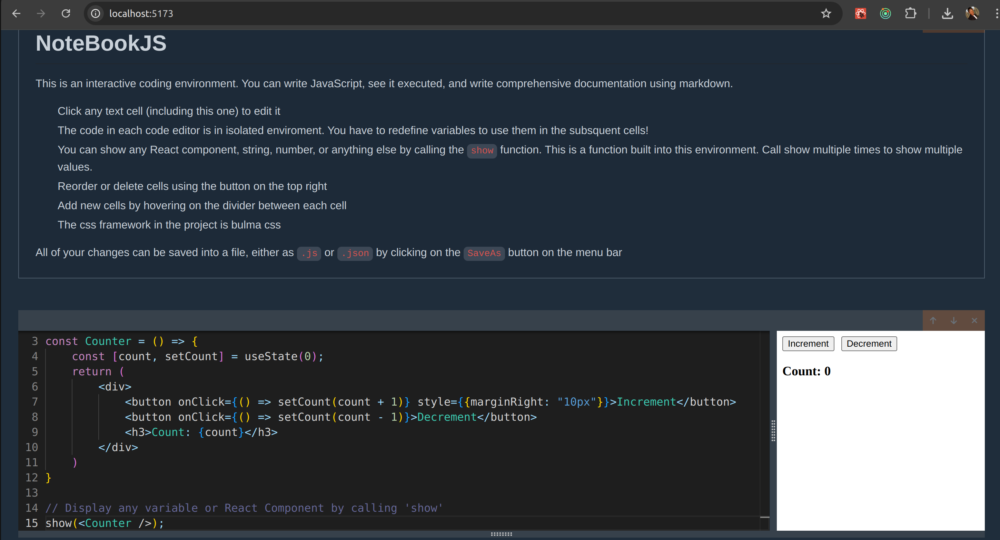

# NoteBookJS

This is an interactive coding environment. You can write JavaScript, see it executed, and write comprehensive documentation using markdown. Similar to google colab notebook

# Tech Stack

- Typescript
- ReactJS
- Redux
- Node
- Express

# Overview



# How To Get Started

1. Ensure you have [NodeJS](https://nodejs.org) installed

2. Clone the repository to your folder

```bash
git clone git@github.com:kosamtech/notebook-js.git
```

3. Install deps for the local-api & build the app

```
cd local-api && npm i && npm run build
```

4. Run the express api

```bash
npm start
```

5. Install deps for the local-client and start the server

```bash
cd local-client && npm i
```

```bash
npm run start
```
